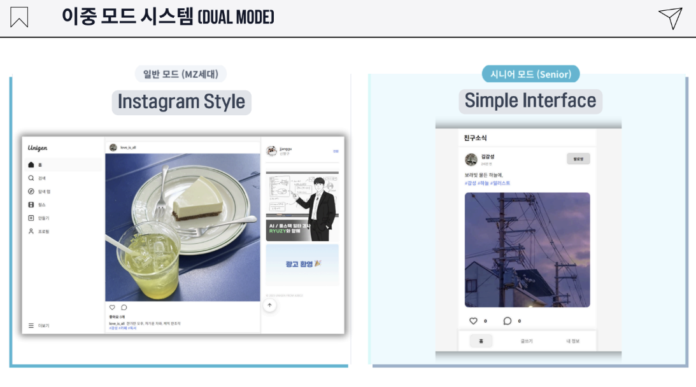
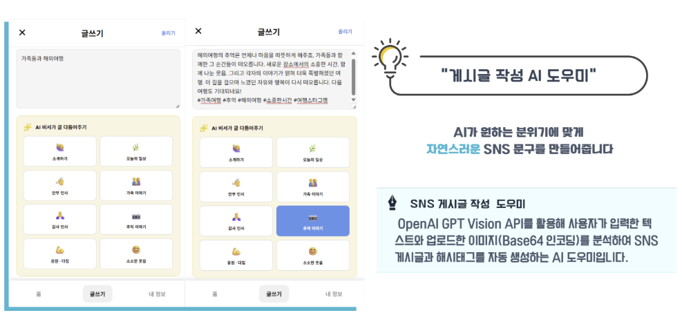
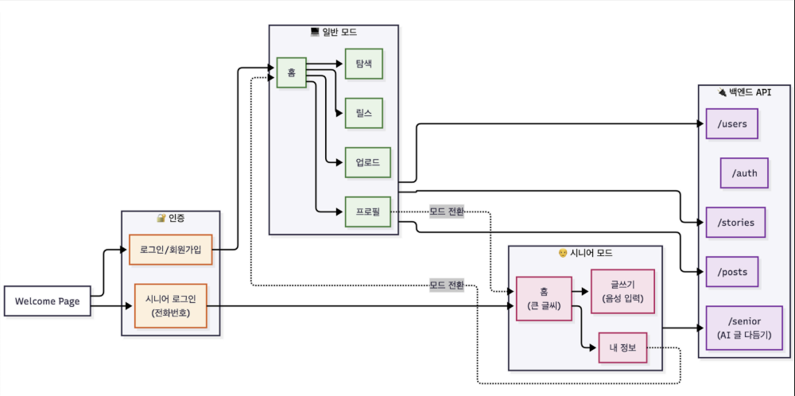

# UniGen Frontend

> 일반 사용자와 시니어 사용자를 함께 고려한 Dual Mode SNS 플랫폼의 React 프론트엔드

<table align="center">
  <tr>
    <td align="center" width="680">
      <a href="https://www.notion.so/325441f66d78810f809ec11f775eb92c?pvs=1"><b>📘 Notion Project Page</b></a><br />
      <sub>프로젝트 상세 문서 · 구현 과정 · 역할 정리 보기</sub>
    </td>
  </tr>
</table>

<p align="center">
  <a href="https://github.com/KDY0829/unigen-front/raw/main/assets/Unigen.mp4">
    
  </a><br />
  <sub>▶ 이미지를 클릭하면 실행 영상을 볼 수 있습니다.</sub>
</p>

## ✨ Highlights

| 구분 | 내용 |
|---|---|
| 문제 | 일반 사용자와 시니어 사용자가 같은 SNS UI를 사용하기 어려움 |
| 해결 | 일반 모드와 시니어 모드를 분리한 Dual Mode UX 제공 |
| 담당 | React 기반 화면 구성, 피드/글쓰기/프로필 UI, 시니어 모드 UX 구현 |
| 결과 | 사용자 유형별로 다른 SNS 사용 경험을 제공하는 프론트엔드 구현 |

---

## 1. 프로젝트 개요

UniGen은 일반 사용자와 시니어 사용자를 하나의 서비스 안에서 함께 고려한 통합 SNS 플랫폼입니다.

프론트엔드는 일반 사용자에게 익숙한 SNS 피드 경험을 제공하고, 시니어 사용자에게는 큰 글씨, 간소화된 UI, 쉬운 글쓰기 흐름을 제공하는 Dual Mode 구조로 설계했습니다.

---

## 2. 서비스 화면

<p align="center">
  
</p>

| 모드 | 설명 |
|---|---|
| 일반 모드 | 피드, 프로필, 댓글, 좋아요, 스토리, 릴스 등 일반 SNS 경험 제공 |
| 시니어 모드 | 큰 글씨, 간소화된 네비게이션, 쉬운 게시물 작성 흐름 제공 |

---

## 3. 주요 기능

- 일반 사용자 / 시니어 사용자 모드 분리
- Instagram 스타일 피드 및 프로필 UI
- 게시물 작성, 이미지 업로드, 댓글, 좋아요 기능
- 스토리, 릴스, 탐색 페이지 구성
- 시니어 친화적인 큰 글씨와 간소화된 UI
- Kakao OAuth 및 인증 페이지 연동
- AI 콘텐츠 생성 기능과 연결되는 UI 흐름

---

## 4. My Role

- React + Vite 기반 프론트엔드 화면 구성
- 일반 모드와 시니어 모드 UX 분리
- 피드, 글쓰기, 프로필, 인증 페이지 흐름 구현
- API 통신 레이어 구성 및 백엔드 연동
- 서비스 소개 및 발표용 화면 정리

---

## 5. UX / System Flow

<p align="center">
  
</p>

위 이미지는 프론트엔드 내부 구조도가 아니라, 사용자가 로그인 후 일반 모드와 시니어 모드로 진입하고, 각 화면이 백엔드 API와 연결되는 전체 UX 흐름을 보여줍니다.

```text
Welcome Page
  → 로그인 / 회원가입
  → 일반 모드 또는 시니어 모드 선택
  → 홈 / 탐색 / 업로드 / 프로필 / 글쓰기
  → users / auth / stories / posts / senior API 연동
```

---

## 6. Tech Stack

| 영역 | 기술 |
|---|---|
| Language | JavaScript, HTML, CSS |
| Framework | React 18, Vite |
| Styling | styled-components |
| Routing | React Router |
| State | React Context API |
| Icons | Lucide React |
| API Client | Axios |
| Auth | Kakao OAuth 연동 |

---

## 7. How to Run

```bash
npm install
npm run dev
```

```text
http://localhost:5173
```

---

## 8. Related Repository

- [KDY0829/unigen-back](https://github.com/KDY0829/unigen-back)
